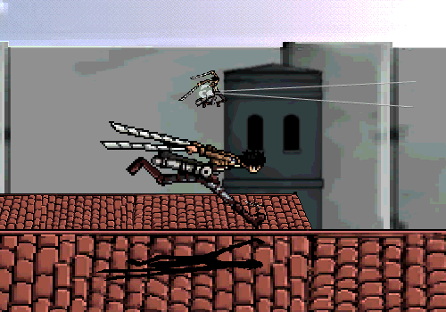
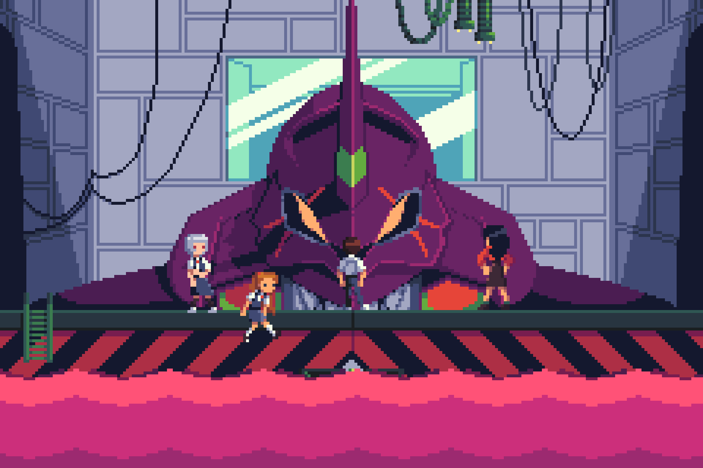
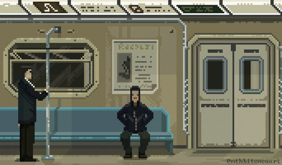

```csharp
  using System;

  class Program
  {
      static void Main()
      {
          Console.WriteLine("Hello, my name is Guilherme!");
          Console.WriteLine("Welcome to my GitHub!");
      }
  }
```

[](https://git.io/typing-svg)

<h1 align="center">
🎓 Information Systems student

🌐 back-end developer

<div align="center">
  
  
  
  
  
  
</div>

</h1>

<div align="center">
  
  
</div>

<h3 align="center">📞 Contato:</h3>

<h2 align="center">
  <div align="center">
    <a href="https://www.linkedin.com/in/guilherme-lins7/" target= "_blank">  </a>
    <a href="mailto:guilherme7lins@gmail.com" target= "_blank">  </a>
  </div>
</h2>

<div align="center">
  
  
  
</div>